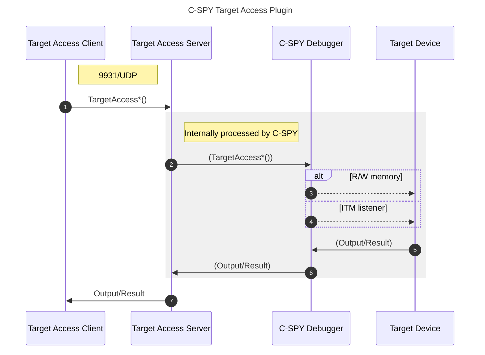

# Getting Started with the Target Access plugin for IAR Embedded Workbench

The Target Access plugin for the C-SPY Debugger, alongside its SDK, are automatically installed with the IAR Embedded Workbench.

The plugin provides a server that listens to the `9931/UDP` port and runs on top of the C-SPY Debugger. Its Target Access SDK provides an API for a third-party client to establish a network connection to the server and, from there, tap into a device target's memory to perform runtime read/write access. The SDK also provides capabilities for a client to monitor hardware ITM events.  



This repository contains simple examples of client applications created with the Target Access SDK. They can connect to the server's UDP port, exposed by the Target Access Client DLL. 

The Target Access Plugin SDK is installed at `C:/path/to/IAR/Embedded/Workbench/arm/src/TargetAccessPlugin`.

> __Note__ For more information on the SDK API details, refer to the _Getting Started Guide for the Target Access Plugin_, installed inside the _Target Access Plugin_ documentation folder (`C:/path/to/IAR/Embedded/Workbench/arm/src/TargetAccessPlugin/doc/TargetAccessPlugin.pdf`).


## Example programs

### Building the example programs
To build the example programs you will need:
- [IAR Embedded Workbench for Arm](https://iar.com/ewarm) V9 or later
- [Microsoft Visual Studio 2022](https://visualstudio.microsoft.com/vs/) or later, installed for C++ Desktop Development

1. Launch "Developer Command Prompt for VS 2022".
2. Clone this repository.
3. Build the examples:
```
cd cspy-target-access-demo/examples
mkdir build && cd build
cmake .. -DTOOLKIT_DIR="C:/path/to/IAR/Embedded/Workbench/x.xx/arm"
cmake --build . --config Release
```
>__Note__ `TOOLKIT_DIR` must point to the `arm` subdirectory in the installation directory of the IAR Embedded Workbench.

Three example programs should be inside the __Release__ directory: `mem-reader.exe`, `mem-writer.exe` and `itm-logger.exe`. Also, a copy of the `TargetAccessClientSDK.dll` library was automatically placed together with these executables.

>__Syntax notes__<br>
>```
>mem-reader <32-bit address>
>```
>```
>mem-writer <32-bit address> <32-bit value>
>```
>```
>itm-logger
>```
>
>__Note__ The `itm-logger` example requires an actual hardware target.

### Running the memory access [example](examples#readme) programs
The memory access example programs can be used with the C-SPY Simulator (or adapted to run on hardware).

1. In IAR Embedded Workbench, open the `cspy-target-access-demo\target\target.eww` workspace.
2. Choose __Project__ → __Download and Debug__ (<kbd>Ctrl</kbd>+<kbd>D</kbd>).
>__Note__ On the __Debug Log__ window, you shall see a message similar to:
> ```
> Sun Jan 01, 2023 12:00:00: TargetAccessPlugin: Started listening on port 9931
> ```
3. Choose __View__ → __Live watch__ and `<click to add>` `buffer` and `val`.
4. In "Developer Command Prompt for VS 2022", execute:
```
.\Release\mem-reader 0x20001000
.\Release\mem-reader 0x20002000
.\Release\mem-writer 0x20001000 0x1000
.\Release\mem-reader 0x20001000
etc.
```

>__Note__ As you use the `mem-writer` application to modify the target's variables `buffer` or `val`, you shall see their updated values in the C-SPY __Live Watch__ window.
>
>

### Running the itm-logger [example](examples#readme) program
For executing the ITM Logger example, you will need to create a new C Project in IAR Embedded Workbench. The program should configure the hardware device target clocks. You will also need a debug probe. For the best experience, we recommend the [IAR I-jet](https://iar.com/ijet).
>__Note__ It is assumed that the hardware provides the **I**nstrumentation **T**race **M**acrocell (for example Cortex-M4). 

1. Create/Generate a new C project that initializes the desired hardware target. If convenient, use the Code Generator provided by the silicon manufacturer.
2. Add `cspy-target-access-demo/target/demo.c` to the project.
3. On the created application's __main.c__ file, add `extern void demo(void);` so you can call `demo()` from the `main()` function, similar to what was done in [target/main.c](target/main.c).
4. Choose __Project__ → __Options__ (<kbd>Alt</kbd>+<kbd>F7</kbd>) → __Debugger__ → __Plugins__ and ☑️ __Target Access Server__.
>__Note__ If necessary, set up:<br>
> - __General Options__ → __Target__ → __Device__.
> - __Debugger__ → __Setup__ → __Driver__ → __I-jet__.
> - __I-jet__ → __Interface__ → __SWD__.
> - and any other relevant project options.

5. Choose __Project__ → __Download and Debug__ (<kbd>Ctrl</kbd>+<kbd>D</kbd>).
6. Choose __I-jet__ → __SWO Configuration__.
7. Select the ITM ports `20` and `21` (23◼️◼️☑️☑️◼️◼️◼️◼️16) and deselect any others.


>__Note__ On Cortex-M devices, there are 32 ITM ports (0-31). ITM ports 0-19 are reserved by IAR Embedded Workbench. When creating client applications, make sure they only use the ITM ports 20-31. Using reserved ITM ports from external client applications may result in undefined behavior.

8. Choose __Debug__ → __Go__ (<kbd>F5</kbd>).
9. In the "Developer Command Prompt for VS 2022", execute:
```
.\Release\itm-logger.exe
```

<details><summary>Output example (click to unfold):</summary>

>```
>[d47c6888e] ITM port 20: 0000005b (1 byte length)
>[d4950f8cb] ITM port 21: 0a3e35ec (4 bytes length)
>[d49ca33f3] ITM port 20: 0000006f (1 byte length)
>[d4b591c11] ITM port 20: 00000079 (1 byte length)
>[d4c90a7ed] ITM port 20: 0000003d (1 byte length)
>[d4c91500f] ITM port 21: 0a40b6a4 (4 bytes length)
>[d4e8fffe6] ITM port 21: 0a424244 (4 bytes length)
>[d4f966a5d] ITM port 21: 0a430c25 (4 bytes length)
>[d5136b290] ITM port 21: 0a444de9 (4 bytes length)
>[d52387343] ITM port 20: 00000079 (1 byte length)
>[d53fd977e] ITM port 20: 000000c9 (1 byte length)
>[d5576ae7d] ITM port 20: 00000083 (1 byte length)
>[d569365f0] ITM port 20: 000000ab (1 byte length)
>[d58422aa1] ITM port 20: 000000a1 (1 byte length)
>[d5947373e] ITM port 21: 0a4a8380 (4 bytes length)
>[d5aa61e0e] ITM port 20: 00000083 (1 byte length)
>[d5c678198] ITM port 21: 0a4cecb4 (4 bytes length)
>[d5de70463] ITM port 20: 000000b5 (1 byte length)
>[d5f36b798] ITM port 21: 0a4f1a09 (4 bytes length)
>[d60b272f0] ITM port 20: 000000d3 (1 byte length)
>[d61a267bb] ITM port 20: 00000047 (1 byte length)
>[d632a4982] ITM port 20: 000000e7 (1 byte length)
>[d6543181e] ITM port 21: 0a53c1f9 (4 bytes length)
>[d6562fe4b] ITM port 20: 00000029 (1 byte length)
>[d68113ea2] ITM port 21: 0a55eb00 (4 bytes length)
>[d68364bbd] ITM port 20: 000000bf (1 byte length)
>[d696e5913] ITM port 20: 0000008d (1 byte length)
>[d6ac34750] ITM port 20: 00000015 (1 byte length)
>[d6af3d321] ITM port 20: 00000001 (1 byte length)
>ITM Listener: on Channels: 0xffffffff Buffer capacity: 1000 Buffer size: 0  
>```

</details>


## Target Access from `cspybat`
The Target Access Server plugin can also be used from the command line, with `cspybat`. 

Append the following parameter in the project's `settings/target.Simulator.general.xcl`:
```
--plugin="C:/path/to/IAR/Embedded/Workbench/common/plugins/TargetAccessServer/TargetAccessServer.dll"
```
So that the `settings/target.Simulator.cspy.bat` script will execute `cspybat` with Target Access support.

>__Note__ Use `Ctrl-C` to terminate the batch job. 


## Disclaimer
The information in this repository is subject to change without notice and does not represent a commitment on any part of IAR. While the information contained herein is assumed to be accurate, IAR assumes no responsibility for any errors or omissions.

## Troubleshooting
If there are technical issues related to the IAR products and you are eligible for support, please get in touch with the IAR support services: https://iar.com/support.
